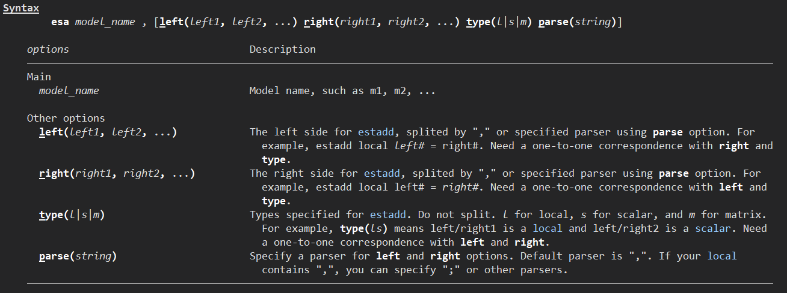

# esa
Estimates store with estadd.

## Install

```stata
* Latest version
cap ado uninstall esa
net install esa, from("https://raw.githubusercontent.com/codefoxs/esa/main/") replace

* Old versions
cap ado uninstall esa
net install esa, from("https://raw.githubusercontent.com/codefoxs/esa/v#.#.#/") replace
```

## Syntax



## Example

### Quick use

```stata
webuse nlswork
xtreg ln_w ttl_exp age tenure not_smsa south i.year, fe cluster(idcode)
esa m1 // same as "est store m1"
```

### Add local/scalar/matrix before using esttab

```stata
webuse nlswork
xtreg ln_w ttl_exp age tenure not_smsa south i.year, fe cluster(idcode)
esa m1, l(ID_FE, YEAR_FE) r(YES, YES) t(ll)
// same as the following commands
// estadd local ID_FE = "YES"
// estadd local YEAR_FE = "YES"
// est store m1

esttab m1 using "demo.rtf", replace ///
            b(%20.4f) t(%20.4f) ///
            scalars(ID_FE YEAR_FE N r2_a) sfmt(%5s %5s %20.0fc %20.4f) ///
            keep(ttl_exp age tenure not_smsa south) ///
            order(ttl_exp age tenure not_smsa south) ///
            title("Regression Resuilts") ///
            substitute("#c." "×" "c." "" "_cons" "Constant" ///
            "r2_a" "Adj. R2" "r2_p" "Pse. R2" "r2" "R2" "_" " ") ///
            nogaps nonotes noobs compress
```

